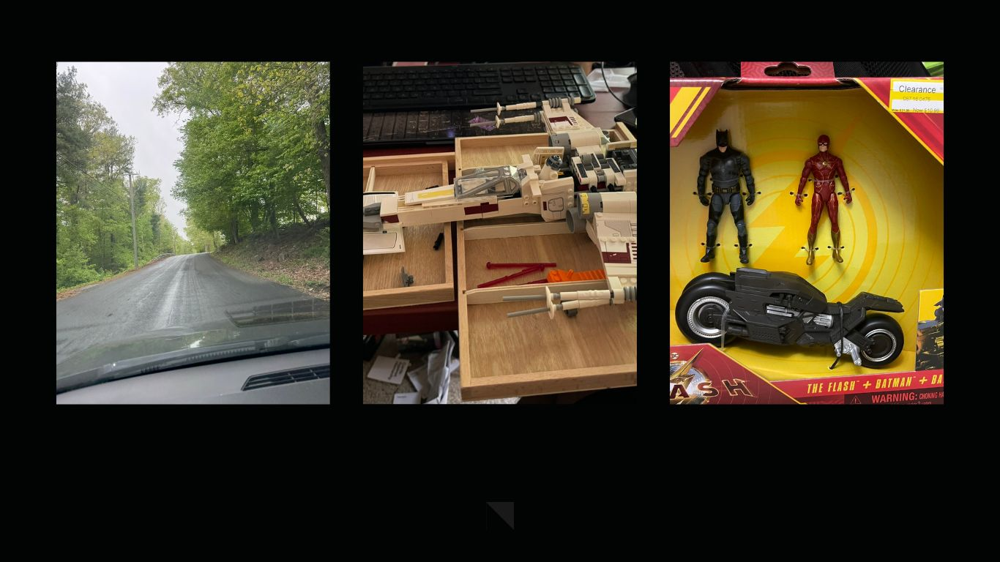

As a classically trained chemical engineer and computational scientist, I am interested in applying mathematics to solve systems design problems. Inverse design of systems based on the interpretation of data or lack thereof pique my curiosity. To keep up with the avant garde nature of machine learning, I am looking forward to running a team of my own. Applications in the field of sustainability, particularly sustainable energy and agriculture are my focus areas.

